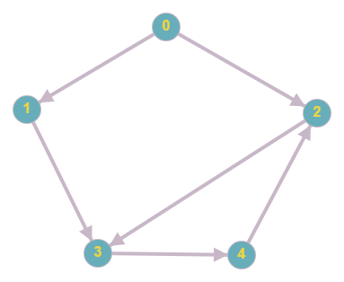
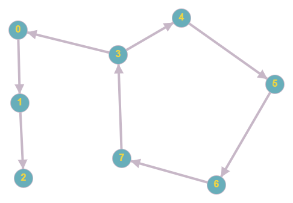

In lecture 8.1, you learned about directed graphs and cycles. In fact, there was even an example of how to use a Depth-First Search (DFS) to detect cycles in a graph. In this exercise, you will be doing something similar. You need to implement an algorithm that determines whether there exists a cycle reachable from node s in the provided graph. With “cycle reachable by node s”, we mean a cycle that we can get “stuck in” if we start a path from node s.

Implement the method boolean detectCycle(Node s, List<Node> nodes), which determines whether there exists a cycle reachable from Node s in the graph that consists of the nodes in List<Node> nodes.

* Return true if there is such a cycle, and false otherwise.

You can find the implementation for the Node class in the library tab.

Example Input: s is the node with ID 0.


Example Output: true

* There is a cycle (2, 3, 4, 2) in this graph, and it is reachable 
from node 0 (since a node in the cycle is reachable from node 0). Therefore, we return true.

Example Input: s is the node with ID 0.


Example Output: false

* There is a cycle in this graph, but it is not reachable from 
  node 0. Therefore, we return false.

```
//SOLUTION//

import java.util.*;

class Solution {

    /**
     * Detects cycles in a connected component.
     *
     * @param s starting vertex in our connected component.
     * @param vertices the vertex that belong to our graph.
     * @return true iff there is a cycle in the connected component the source belongs to.
     */
    public static boolean detectCycle(Vertex s, List<Vertex> vertices) {
        //TODO
    }
}
```

```
//LIBRARY//

class Vertex {

    List<Vertex> outgoingEdges;

    int id;

    public Vertex(int id) {
        this.outgoingEdges = new ArrayList<>();
        this.id = id;
    }

    public List<Vertex> getOutgoingEdges() {
        return outgoingEdges;
    }

    public int getId() {
        return id;
    }

    public String toString() {
        return Integer.toString(id);
    }

    @Override
    public int hashCode() {
        return id;
    }
}
```

