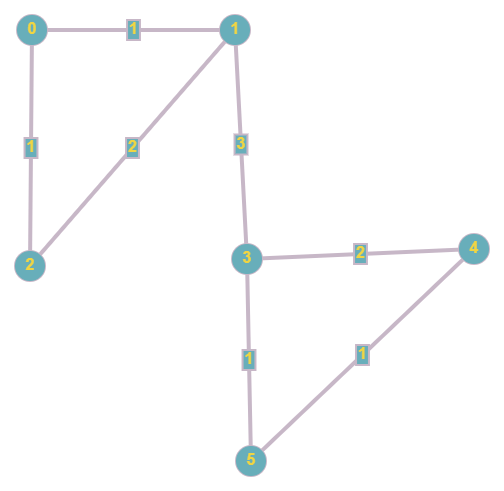
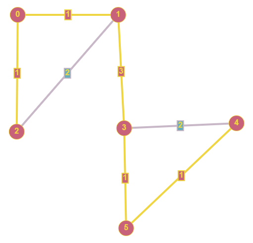

This week you learned about the Minimum Spanning Tree (MST) problem. You saw a specific solution to that problem, Kruskal’s algorithm. As a reminder, the main idea of Kruskal is the following:

   * Maintain a partition of the vertices into clusters.
   * Initially, each vertex forms a single cluster.
   * Each cluster contains a part of the MST that we are building.
   * Pick an edge u,v with the smallest weight/cost that is not part of the MST yet. 
   * If the clusters of u and v are different, merge both using 
     the edge u,v).
   * Otherwise, don’t include the edge in the MST.
   * Repeat until we have obtained a single cluster (or until there are no edges left, in which case no valid MST can be formed. For this assignment, you can assume there will always be a valid MST).

Although conceptually it makes sense, you might be wondering how you can efficiently keep track of the different clusters. Next year, you will learn that in Algorithm Design! For now, all you need to know is that we can achieve it using the Union-Find data structure. You don’t need to understand how it works, but you need to understand how to use it.

The UnionFind data structure allows us to maintain disjoint sets (such as components of a graph). Below are the main methods that you might find helpful to complete this exercise:

* The UnionFind(int n) constructor will create a structure to hold 
n different disjoint sets, each holding a single element labeled from 0 to n - 1.
* The operation boolean union(int i, int j) will merge the sets containing elements i and j. It returns true if i and j belonged to different sets and false if they were already part of the same set.
* The method int find(int u) returns the ID of the set that 
  contains element u.

To help you out even more, we have implemented an Edge class with 
 a special property. It implements the Comparable interface so that you can sort them increasingly on their cost. You can create a normal priority queue (PriorityQueue<Edge>) and have it always return the edge with the smallest cost.

**Method:** List<Edge> buildMST(int n, List<Edge> edges) builds a Minimum Spanning Tree (MST) of a graph using Kruskal’s Algorithm.

* int n is the number of nodes present in the graph (nodes are 
labeled 0 to n - 1).
*    List<Edge> edges is a list of edges that belong to the graph. 
     You should leave this list as you found it, do not manipulate the input list.

Method should return the list of edges that should be included in the MST of the graph.

Sometimes a single graph can produce multiple MSTs! You can return any of them :)

**In an exam scenario using any other method besides Kruskal’s algorithm (e.g. brute-forcing) could result in a grade of 1 for that exercise.**

**Exampl**e (from the test you have available to you)



Should return the edges highlighted in yellow…


**Hint:** Remember that we are dealing with a UnionFind structure that keeps track of x elements labeled 0 to x - 1, and curiously our n nodes are also labeled 0 to n - 1. You can use the UnionFind structure to track whether nodes are already connected or not.

```
//SOLUTION//
import java.util.*;

class Solution {

    /**
     * Builds a Minimum Spanning Tree (MST) using
     * Kruskal's Algorithm (as learned in class).
     * Nodes are numbered from 0 to n - 1.
     *
     * @param n the amount of nodes in the graph
     * @param edges the edges that comprise the graph
     * @return the list of edges that should be included in the MST
     */
    public static List<Edge> buildMST(int n, List<Edge> edges) {
        // TODO
    }
}
```

```
//LIBRARY//
class Edge implements Comparable<Edge> {

    private int from;

    private int to;

    private int cost;

    public Edge(int from, int to, int cost) {
        this.from = from;
        this.to = to;
        this.cost = cost;
    }

    public int getFrom() {
        return from;
    }

    public int getTo() {
        return to;
    }

    public int getCost() {
        return cost;
    }

    @Override
    public int compareTo(Edge o) {
        return Integer.compare(this.cost, o.cost);
    }

    @Override
    public String toString() {
        return "Edge{" + "from=" + from + ", to=" + to + ", cost=" + cost + '}';
    }
}

class UnionFind {

    private int[] parent;

    private int[] rank;

    // Union Find structure implemented with two arrays for Union by Rank
    public UnionFind(int size) {
        parent = new int[size];
        rank = new int[size];
        for (int i = 0; i < size; i++) parent[i] = i;
    }

    /**
     * Merge two clusters, if they are not already part of the same cluster.
     *
     * @param i
     *     a node in the first cluster
     * @param j
     *     a node in the second cluster
     * @return true iff i and j had different clusters.
     */
    boolean union(int i, int j) {
        int parent1 = find(i);
        int parent2 = find(j);
        if (parent2 == parent1) return false;
        if (rank[parent1] > rank[parent2]) {
            parent[parent2] = parent1;
        } else if (rank[parent2] > rank[parent1]) {
            parent[parent1] = parent2;
        } else {
            parent[parent2] = parent1;
            rank[parent1]++;
        }
        return true;
    }

    /**
     * This function find the cluster that node i belongs to.
     *
     * @param i
     *     index of a node
     * @return the root of the subtree containg i.
     */
    int find(int i) {
        int parent = this.parent[i];
        if (i == parent) {
            return i;
        }
        return this.parent[i] = find(parent);
    }

    // Return the rank of the trees
    public int[] getRank() {
        return rank;
    }

    // Return the parent of the trees
    public int[] getParent() {
        return parent;
    }
}
```